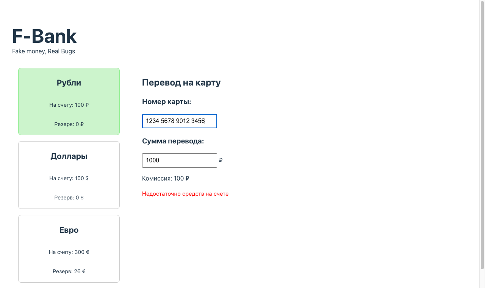
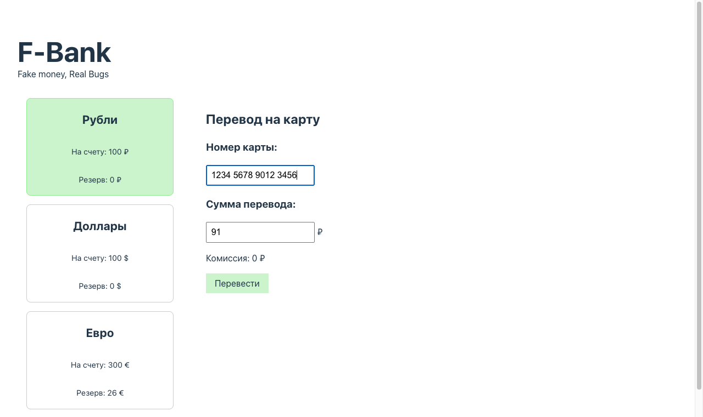

# BUG-01 — Комиссия рассчитывается с округлением до десятков рублей вместо рублей при сумме перевода, не кратной 10

## Метаданные

| Поле | Значение |
|---|---|
| **ID** | BUG-01 |
| **Severity** | 🟡 Major |
| **Priority** | High |
| **Модуль** | Расчет комиссии (форма перевода рублей) |
| **Найден** | Ручное тестирование, чек-лист п. 17–18 |

## Окружение

- **Сервис**: F-Bank, статичная сборка из `dist/`
- **URL запуска**: `http://localhost:8000/?balance=100&reserved=0`
- **Браузер**: Google Chrome 124.0.6367 (последняя стабильная)
- **ОС**: macOS 14.6 (применимо к любой ОС, дефект в JS-коде сервиса)

## Предусловия

1. Сервис F-Bank запущен локально командой `python3 -m http.server 8000 --directory dist`.
2. Открыта страница с параметрами `balance=100`, `reserved=0` (доступная сумма = 100 руб.).

## Шаги воспроизведения

1. Открыть `http://localhost:8000/?balance=100&reserved=0`.
2. Кликнуть на карточку «Рубли».
3. В поле «Номер карты» ввести 16 цифр: `1234567890123456`.
4. В поле «Сумма перевода» ввести значение `91`.
5. Посмотреть на отображаемую комиссию под полем суммы.

## Ожидаемый результат

Комиссия = 9 руб. (по спецификации: 10 % от суммы с округлением вниз до рубля, `floor(91 × 0.1) = floor(9.1) = 9`).

## Фактический результат

Комиссия = **0 руб.** Кнопка «Перевести» появляется.

## Скриншоты

Форма перевода после ввода номера карты, до ввода суммы:



После ввода суммы 91 — комиссия отображается как 0 руб., кнопка «Перевести» присутствует:



## Дополнительная информация

### Корневая причина

В `dist/assets/index-BUH56GOL.js` обнаружена строка:

```js
h = Math.floor(O/100)*10
```

где `O` — введённая сумма перевода, `h` — итоговая комиссия. Формула `floor(O/100)*10` округляет вниз до **десятков рублей**, а не до рублей. Согласно спецификации, должно быть:

```js
h = Math.floor(O*0.1)        // или эквивалент Math.floor(O/10)
```

### Таблица расхождений

| Сумма перевода `O` | Комиссия по спеке | Комиссия по факту | Совпадает |
|---|---|---|---|
| 91 | 9 | 0 | ❌ |
| 99 | 9 | 0 | ❌ |
| 100 | 10 | 10 | ✅ |
| 199 | 19 | 10 | ❌ |
| 1000 | 100 | 100 | ✅ |

Дефект проявляется на любых суммах, **не кратных 10**. На суммах, кратных 10, формула случайно даёт верный результат — это маскирует баг при поверхностном тестировании на «круглых» значениях.
