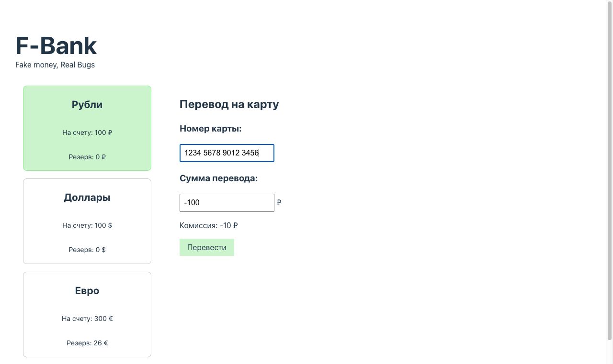
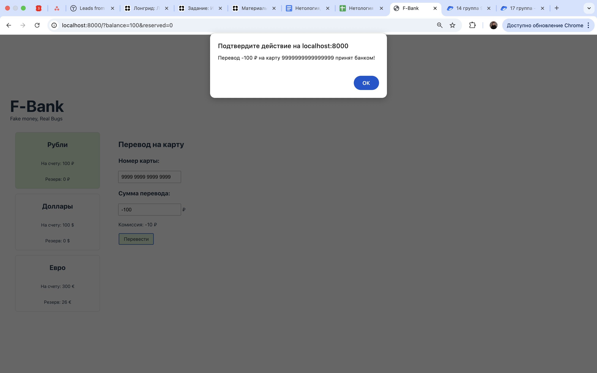

# BUG-02 — Поле суммы перевода принимает отрицательные значения, банк подтверждает перевод отрицательной суммы

## Метаданные

| Поле | Значение |
|---|---|
| **ID** | BUG-02 |
| **Severity** | 🔴 Critical |
| **Priority** | Critical |
| **Модуль** | Валидация поля «Сумма перевода» |
| **Найден** | Ручное тестирование, чек-лист п. 12 |

## Окружение

- **Сервис**: F-Bank, статичная сборка из `dist/`
- **URL запуска**: `http://localhost:8000/?balance=100&reserved=0`
- **Браузер**: Google Chrome 124.0.6367 (последняя стабильная)
- **ОС**: macOS 14.6 (применимо к любой ОС, дефект в JS-коде сервиса)

## Предусловия

1. Сервис F-Bank запущен локально командой `python3 -m http.server 8000 --directory dist`.
2. Открыта страница с параметрами `balance=100`, `reserved=0` (доступная сумма = 100 руб.).

## Шаги воспроизведения

1. Открыть `http://localhost:8000/?balance=100&reserved=0`.
2. Кликнуть на карточку «Рубли».
3. В поле «Номер карты» ввести 16 цифр: `1234567890123456`.
4. В поле «Сумма перевода» ввести значение `-100`.
5. Посмотреть на состояние формы: значение поля, наличие кнопки «Перевести».
6. Нажать на кнопку «Перевести».

## Ожидаемый результат

- Поле «Сумма перевода» **блокирует** ввод знака `-` или **сбрасывает** отрицательное значение в `0` / показывает ошибку валидации.
- Кнопка «Перевести» **не отображается** при отрицательном значении.
- Сервис не подтверждает перевод отрицательных сумм ни при каких условиях (нарушение бизнес-логики банка — фактически приводит к зачислению средств плательщику вместо списания).

## Фактический результат

- Поле принимает значение `-100` без блокировки и без сообщения об ошибке.
- Отображается «Комиссия: -10 руб.».
- Кнопка «Перевести» появляется и активна.
- При нажатии на «Перевести» появляется системное уведомление: «Перевод -100 руб. на карту 1234567890123456 принят банком!».

## Скриншоты

Форма перевода после ввода номера карты, до ввода суммы:


После ввода суммы `-100` — отображается комиссия, появляется кнопка «Перевести»:



После клика на «Перевести» — системное уведомление подтверждает перевод отрицательной суммы:



## Дополнительная информация

### Корневая причина

В `dist/assets/index-BUH56GOL.js` обработчик `onChange` поля суммы:

```js
(j === "" || j === "-") && (j = "0")
```

Логика преобразует пустую строку и одиночный минус в `"0"`, но **не выполняет проверку `< 0`**. Любое значение, начинающееся с минуса и содержащее цифры (`-100`, `-1`, `-99999`), проходит как валидное.

Корректная обработка требует одного из вариантов:
- проверка `parseInt(j) < 0` с откатом значения;
- HTML-атрибут `min="0"` на инпуте + клиентская валидация на submit;
- запрет ввода символа `-`.
