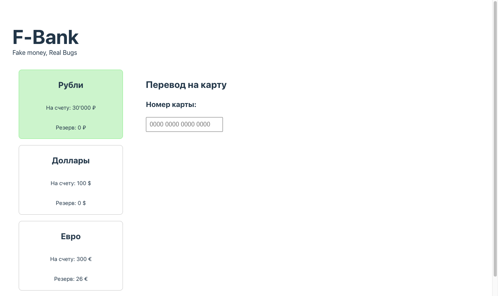
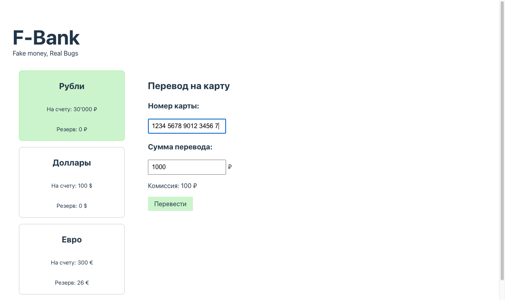

# BUG-03 — Поле «Номер карты» принимает 17 цифр вместо ровно 16, форма продолжает работать с невалидным номером

## Метаданные

| Поле | Значение |
|---|---|
| **ID** | BUG-03 |
| **Severity** | 🟡 Major |
| **Priority** | High |
| **Модуль** | Валидация поля «Номер карты» |
| **Найден** | Ручное тестирование, чек-лист п. 6 |

## Окружение

- **Сервис**: F-Bank, статичная сборка из `dist/`
- **URL запуска**: `http://localhost:8000/?balance=30000&reserved=0`
- **Браузер**: Google Chrome 124.0.6367 (последняя стабильная)
- **ОС**: macOS 14.6 (применимо к любой ОС, дефект в JS-коде сервиса)

## Предусловия

1. Сервис F-Bank запущен локально командой `python3 -m http.server 8000 --directory dist`.
2. Открыта страница с параметрами `balance=30000`, `reserved=0`.

## Шаги воспроизведения

1. Открыть `http://localhost:8000/?balance=30000&reserved=0`.
2. Кликнуть на карточку «Рубли».
3. В поле «Номер карты» ввести подряд 17 цифр: `12345678901234567`.
4. Посмотреть на значение поля (с учётом форматирования пробелами каждые 4 символа).
5. Попробовать ввести 18-ю цифру.

## Ожидаемый результат

- После ввода 16-й цифры поле **блокирует** ввод любых дополнительных цифр.
- В поле остаётся ровно 16 цифр (без учёта пробелов-разделителей).
- Спецификация требует фиксированную длину номера карты — 16 цифр (стандарт для большинства платёжных систем: Visa, MasterCard, Мир).

## Фактический результат

- Поле принимает 17 цифр.
- Только начиная с **18-й** цифры срабатывает блокировка.
- Значение поля содержит 17 цифр, форма продолжает работать с невалидным номером карты, поле «Сумма перевода» появляется, кнопка «Перевести» доступна, перевод подтверждается банком на 17-значный номер.

## Скриншоты

Пустое поле «Номер карты» сразу после клика на карточку «Рубли»:



После ввода 17 цифр подряд — поле приняло все 17, форма продолжает работать с невалидным номером:



## Дополнительная информация

### Корневая причина

В `dist/assets/index-BUH56GOL.js` логика обрезки длины:

```js
L.length > 17 && (L = L.slice(0, 17))
```

Условие срабатывает только если длина **строго больше 17**. То есть значение длиной ровно 17 проходит без обрезки. Корректное условие:

```js
L.length > 16 && (L = L.slice(0, 16))
```
